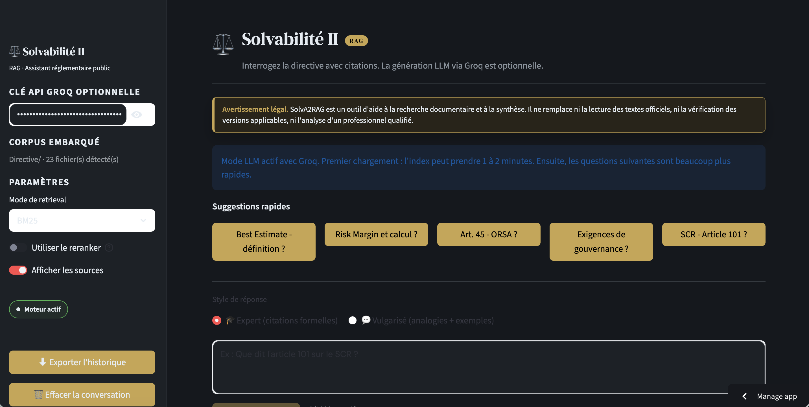

# SolvaIIRAG

[](https://solva2rag-beta.streamlit.app/)

**A deployment-ready Solvency II regulatory intelligence assistant with cited answers, embedded source documents, and a public Streamlit interface.**

SolvaIIRAG is a Retrieval-Augmented Generation (RAG) application built for insurance regulation. It helps users ask practical questions about Solvency II and inspect the source passages behind each answer. The goal is not to hide regulatory complexity behind a chatbot, but to make dense supervisory material searchable, explainable, and auditable.

The project is designed as a public portfolio application: a visitor can open the app, choose a suggested question, and receive sourced results without configuring a local folder, uploading files, or providing an API key.



## Executive Summary

Solvency II documentation is spread across directives, delegated regulations, EIOPA material, local supervisory notices, and Q&A pages. For risk, actuarial, compliance, and consulting teams, the challenge is rarely a lack of information. The challenge is finding the relevant paragraph quickly, understanding its context, and keeping a traceable link to the source.

SolvaIIRAG addresses that workflow with:

- **A curated embedded corpus** of Solvency II documents included directly in the repository.
- **Automatic startup indexing** so the public demo works immediately for a first-time visitor.
- **Retrieval-first answers** that expose source passages instead of relying on ungrounded generation.
- **Optional LLM synthesis** for clearer explanations when a Groq API key is available.
- **A Streamlit interface** designed for a recruiter, Chief Risk Officer, or technical reviewer to understand the value in under a minute.

## What This Demonstrates

This project is meant to show more than a working chatbot. It demonstrates the ability to turn a regulatory problem into a usable product:

| Capability | How it appears in the project |
| --- | --- |
| Insurance domain understanding | Solvency II concepts such as SCR, Best Estimate, Risk Margin, ORSA, governance, SFCR/RSR, and EIOPA guidance are built into the demo flow. |
| RAG system design | Documents are loaded, chunked, indexed, retrieved, ranked, and displayed with citations. |
| Product judgment | The app no longer asks public users for a local path; the corpus is embedded and the index loads automatically. |
| Traceability | Answers remain connected to document names, pages, sections, and retrieved snippets. |
| Deployment awareness | The app supports Streamlit Community Cloud and works without requiring a private API key. |

## Key Features

- **Embedded regulatory corpus** in `Directive/`, including EU, EIOPA, ACPR, and BNB/NBB material.
- **Zero-configuration public demo**: no local path input, no file upload, no mandatory API key.
- **Automatic index loading** at app startup, so users can ask a question immediately.
- **BM25 retrieval** for fast keyword search on legal and regulatory wording.
- **Hybrid retrieval path** with Chroma and multilingual sentence embeddings when the vector index is available.
- **Optional reranking** with a cross-encoder to improve source ordering.
- **Optional Groq LLM synthesis** through `GROQ_API_KEY`; without it, the app still returns sourced retrieval results.
- **Citation-first user experience** with document names, pages, retrieved excerpts, and exportable question history.

## Example Questions

The app is structured around real regulatory questions a Solvency II user might ask:

- What does Article 101 say about the SCR?
- How is the Risk Margin calculated?
- What are the governance requirements under Solvency II?
- What does Article 45 say about ORSA?
- How is the Best Estimate defined?

## Architecture

```mermaid
flowchart LR
    Q["User question<br/><b>Example: Article 77 - Best Estimate?</b>"]

    subgraph ING["1. Document ingestion"]
        D["Solvency II corpus<br/>Directive 2009/138/EC<br/>Delegated Regulation 2015/35<br/>EIOPA - ACPR - BNB"]
        P["Multi-format parser<br/>PDF - DOCX - HTML<br/>OCR fallback"]
        C["Chunking + metadata<br/>article - page<br/>jurisdiction - version"]
    end

    subgraph RET["2. Hybrid retrieval"]
        B["BM25 Okapi<br/>Lexical search"]
        E["Multilingual embeddings<br/>multilingual-e5-large<br/>ChromaDB"]
        F["RRF fusion<br/>BM25 x 0.60<br/>Vector x 0.40<br/>Top-60 candidates"]
        R["Cross-encoder reranker<br/>multilingual ms-marco<br/>Top-8 chunks"]
    end

    subgraph GEN["3. Controlled answer generation"]
        H["Norm hierarchy<br/>Directive > Delegated Acts<br/>EIOPA > Local supervisor"]
        L["Optional LLM synthesis<br/>Groq - llama-3.3-70b<br/>Structured system prompt"]
        A["Audit log JSONL<br/>question - sources<br/>scores - model"]
    end

    O["Final answer<br/><b>Plain language - Regulation - Practice - Limits</b><br/>Citations: Article - Source - Page"]

    Q --> D --> P --> C
    C --> B
    C --> E
    B --> F
    E --> F
    F --> R
    R --> H
    H --> L
    L --> O
    R --> A
    O --> A

    classDef input fill:#F4F7FA,stroke:#4B5563,stroke-width:1.4px,color:#111827;
    classDef ingest fill:#E6F7F1,stroke:#1D9E75,stroke-width:1.6px,color:#064E3B;
    classDef lexical fill:#E8F1FC,stroke:#378ADD,stroke-width:1.6px,color:#123B66;
    classDef vector fill:#EEEAFE,stroke:#7F77DD,stroke-width:1.6px,color:#35266B;
    classDef rank fill:#FFF4DB,stroke:#EF9F27,stroke-width:1.8px,color:#7A4B00;
    classDef gen fill:#EDF8E8,stroke:#639922,stroke-width:1.6px,color:#274C0A;
    classDef audit fill:#FDEDE8,stroke:#D85A30,stroke-width:1.6px,color:#7A2411;
    classDef output fill:#EAF8F2,stroke:#15805F,stroke-width:2px,color:#064E3B;

    class Q input;
    class D,P,C ingest;
    class B lexical;
    class E vector;
    class F,R rank;
    class H,L gen;
    class A audit;
    class O output;
```



### Main Components

| File / folder | Purpose |
| --- | --- |
| `app_solvency_rag_llm.py` | Streamlit application, public UX, session state, controls, answer display, and source rendering. |
| `solvency_notebook_runtime.py` | Static Python runtime for retrieval, chunk loading, citations, fallback behavior, and answer generation. |
| `Directive/` | Embedded Solvency II corpus used by the public app. |
| `rag3_index/chunks.jsonl` | Pre-built auditable chunk store used by BM25 and retrieval fallback. |
| `RAG3_SolvencyII_improved.ipynb` | Research notebook used during experimentation and development. |
| `.streamlit/config.toml` | Streamlit deployment configuration. |

## User Journey

1. A visitor opens the public Streamlit URL.
2. The app loads the Solvency II index automatically.
3. The visitor clicks a suggested question or types a custom one.
4. The retrieval engine finds relevant regulatory passages.
5. The answer appears with citations and source excerpts.
6. If a Groq key is configured, the app adds a synthesized explanation grounded in the retrieved context.

## Technical Choices

- **BM25 first** because regulatory users often search for exact legal wording, article numbers, and defined terms.
- **Multilingual embeddings** because the corpus contains French and English supervisory material.
- **Static runtime module** to keep deployment readable and avoid dynamic notebook execution in production code.
- **Embedded corpus** so the app is usable by external reviewers without access to the developer's local machine.
- **Graceful LLM fallback** so the product still works as a cited search assistant without paid API access.

## Run Locally

```bash
pip install -r requirements.txt
streamlit run app_solvency_rag_llm.py
```

Expected repository layout:

```text
SolvaIIRAG/
├── app_solvency_rag_llm.py
├── solvency_notebook_runtime.py
├── Directive/
├── rag3_index/
├── assets/
└── requirements.txt
```

## Deploy on Streamlit Community Cloud

1. Push this repository to GitHub.
2. Create a new app on Streamlit Community Cloud.
3. Select branch `main` and entrypoint `app_solvency_rag_llm.py`.
4. Optional: add `GROQ_API_KEY` in Streamlit secrets to activate LLM synthesis.

The app remains usable without a Groq key in retrieval-only mode.

## Limitations and Next Steps

- This is a regulatory research assistant, not legal advice.
- The quality of answers depends on the completeness and freshness of the embedded corpus.
- LLM-generated synthesis should be reviewed against the displayed sources.
- Some scanned PDFs may require OCR quality checks before production use.
- Future improvements could include source freshness monitoring, richer evaluation metrics, access controls for private corpora, and a production-grade observability layer.

## Version Francaise

SolvaIIRAG est une application Streamlit qui permet d'interroger un corpus Solvabilite II avec citations. Le corpus est inclus dans le repository, l'index se charge automatiquement, et l'application reste utilisable sans cle API grace au mode retrieval avec extraits sources.

Le projet met en avant trois competences: comprehension du domaine assurance, conception d'un systeme RAG traçable, et attention portee a l'experience utilisateur d'une application publique.

## Security and Secrets

Do not commit `.streamlit/secrets.toml`, `.env`, API keys, tokens, or private credentials.
